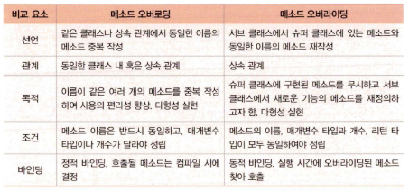

# 전유빈 202230232

## 4월 19일 강의

### 추상 클래스

* 추상 메소드 (abstract method)
    * abstract로 선언된 메소드, 메소드의 코드는 없고 원형만 선언
    ~~~ java
    abstract public String getName();
    abstract public String fail() {return "Good Bye";} //추상 메소드 아님
    ~~~
* 추상 클래스 (abstract class)
    * 추상 메소드를 가지며, abstract로 선언된 클래스
    * 추상 메소드 없이, abstract로 선언한 클래스

### 추상 클래스의 상속과 구현
* 추상 클래스의 상속
    * 추상 클래스를 상속 받으면 추상 클래스가 됨
    * 서브 클래스도 abstract로 선언해야 함

### 추상 클래스의 목적
* 상속을 위한 슈퍼 클래스로 활용하는 것
* 서브 클래스에서 추상 메소드 구현
* 다형성 실현

### 자바의 인터페이스
* 자바의 인터페이스
    * 클래스가 구현해야 할 메소드들이 선언되는 추상형
    * 인터페이스 선언
        * interface 키워드로 선언

* 자바 인터페이스에 대한 변화
    * java 8 ~
        * 상수와 추상메소드 포함
        * default 메소드 포함
        * priavte 메소드 포함
        * static 메소드 포함

### 인터페이스의 구성요소들의 특징
* 인터페이스의 구성 요소들
    * 상수
        * public만 허용, public static final 생략
    * 추상 메소드

### 인터페이스 상속
* 인터페이스 간에 상속 가능
    * 인터페이스를 상속하여 확장된 인터페이스 작성 가능
    * extends 키워드로 상속 선언

### 인터페이스 구현
* 인터페이스의 추상 메소드를 모두 구현한 클래스 작성
    * implements 키워드 사용

### 패키지 개념과 필요성
* 여러명이 자바 응용프로그램을 개발하는 경우, 동일한 이름의 클래스가 존재할 가능성이 있음
    
    -> 합칠 때 오류의 가능성 있음

### 패키지와 모듈
* 패키지 (package)
    * 서로 관련된 클래스와 인터페이스를 컴파일한 클래스 파일들을 묶어놓은 디렉터리
    * 하나의 응용 프로그램은 한 개 이상의 패키지로 작성
    * 패키지는 jar 파일로 압축할 수 있음

* 모듈 (module)
    * 여러 패키지와 이미지 등의 자원을 모아 놓은 컨테이너
    * 하나의 모듈을 하나의 .jmod 파일에 저장

### 자바 모듈화의 목적
* 모듈화의 목적
    * java 9부터 자바 api를 여러 모듈(99개)로 분할
    * 응용 프로그램이 실행할 때 꼭 필요한 모듈들로만 실행 환경 구축
        * 메모리 자원이 열악한 작은 소형 기긱에 꼭 필요한 모듈로 구성된 작은 크기의 실행 이미지를 만들기 위함
* 모듈의 현실
    * java 9부터 전면적으로 도입
    * 복잡한 개념
    * 큰 자바 응용프로그램에는 개발, 유지보수 등에 적합
    * 현실적으로 모듈로 나누어 자바 프로그램을 작성할 필요 없음

### 자바 JDK에 제공되는 모듈 파일들
    * 자바가 설치된 jmods 디렉터리에 모듈 파일 존재
        * .jmod 확장자를 가진 파일
        * 모듈 파일은 zip 포맷으로 압축된 파일

### 패키지 사용하기, import문
* 다른 패키지에 작성된 클래스 사용
    * import를 이용하지 않는 경우

* 필요한 클래스만 import
    * 소스 시작부분에 클래스의 경로명 import
    * import 패키지.클래스

* 패키지 전체를 import
    * 소스 시작 부분에 패키지의 경로명.* import
    * import java.util.*;

### 패키지 만들기
* 클래스 파일이 저장되는 위치는?
    * 클래스나 인터페이스가 컴파일되면 클래스 파일 생성
    * 클래스 파일은 패키지로 선언된 디렉터리에 저장
* 패키지 선언
    * 소스 파일의 맨 앞에 컴파일 후 저장될 패키지 지정
        * package 패키지명;

### 디폴트 패키지
* 패키지 선언문이 없는 경우

### 모듈 개념
* Java 9에서 도입된 개념
* 패키지와 이미지등의 리소스를 담은 컨테이너
* 모듈 파일(.jmod)로 저장

### 자바 플랫폼의 모듈화
* 자바 플랫폼
    * 자바 개발환경 JDK와 자바 실행환경 JRE를 지칭
        * JAVA SE(API) 포함

### 자바 모듈화의 목적
* 자바 컴포넌트들을 필요에 따라 조립하여 사용하기 위함
* 컴퓨터 시스템의 불필요한 부담 감소
    * 세밀한 모듈화를 통해 필요 없는 모듈이 로드되지 않게 함
    * 소형 IoT 장치에도 자바 응용프로그램이 실행되고 성능을 유지하게 함

### JDK의 주요 패키지
* java.lang
* java.util
* java.io
* java.awt

### Object 클래스
* 객체의 속성을 나타내는 메소드 제공

### toString() 메소드
* 각 클래스는 toString() 을 오버라이딩 하여 자신만의 문자열 리턴 가능

### 객체 비교(==)와 equals() 메소드
* == 연산자
    * 객체 레퍼런스 비교
* boolean equals ( Object obj )
    * 두 객체의 내용물 비교
    * 객체의 내용물을 비교하기 위해 클래스의 멤버로 작성

* == 은 해당 객체가 메모리, 주소값 등을 포함해 모두 같은 값인가 비교하는 연산자 / equals() 는 객체 안에 담겨있는 데이터값이 같은지 비교하는 연산자

## 4월 12일 강의

### static
* static 멤버는 클래스당 하나만 생성
* 객체들에 의해 공유됨
* C의 전역 변수

### static과 non-static 특성

### static 멤버 사용
* 클래스 이름으로 접근 가능
~~~ java
    staticSample.m;
    staticSample.f();
~~~
* non-static 멤버는 클래스 이름으로 접근 안 됨
* static은 클래스 이름으로, non-static은 객체 이름으로 호출

### Static 메소드의 제약 조건
* static 메소드는 오직 static 멤버만 접근 가능
    * 객체가 생성되지 않은 상황에서도 static 메소드는 실행될 수 있기 때문에, non-static 멤버 활용 불가
    * non-static 메소드는 static 멤버 사용 가능
* static 메소드는 this 사용 불가
    * static 메소드는 객체 없이도 사용 가능하므로, this 레퍼런스 사용할 수 없음

### fimal 클래스와 메소드
* final 클래스 - 더 이상 클래스 상속 불가능

### 상속
* 객체 지향 상속

### 클래스 상속과 객체
* 상속 선언
    * extends 키워드로 선언
        * 부모 클래스를 물려받아 확장한다는 의미
    * 부모 클래스 -> 슈퍼 클래스 (super class)
    * 자식 클래스 -> 서브 클래스 (sub class)

### 자바 상속의 특징
* 클래스 다중 상속 불허
    * C++은 다중 상속 가능
* 자바는 인터페이스의 다중 상속 허용

### protected 멤버
*  protected 멤버에 대한 접근
    * 같은 패키지의 모든 클래스에게 허용
    * 상속되는 서브클래스에게 (같은 패키지든 다른 패키지든 상관 없음) 허용

### 슈퍼 클래스의 멤버에 대한 서브 클래스의 접근

### 서브 클래스 / 슈퍼 클래스의 생성자 호출과 실행
* 서브 클래스의 객체가 생성될 때
    * 슈퍼 클래스 생성자와 서브 클래스 생성자 모두 실행
    * 호출 순서
        * 서브 클래스의 생성자 먼저 호출
        * 서브 클래스의 생성자는 실행 전 슈퍼 클래스 생성자 호출
    * 실행 순서
        * 슈퍼클래스의 생성자가 먼저 실행

### 서브 클래스와 슈퍼 클래스의 생성자 선택
* 슈퍼 클래스와 서브 클래스
    * 각각 여러 개의 생성자 작성 가능
* 서브 클래스의 객체가 생성될 때
    * 슈퍼 클래스 생성자 1개와 서브 클래스 생성자 1개가 실행
* 서브 클래스의 생성자와 슈퍼 클래스의 생성자가 결정되는 방식
    1. 개발자의 명시적 선택
        * 서브 클래스 개발자가 슈퍼 클래스의 생성자 명시적 선택
        * super() 키워드
    2. 컴파일러가 기본생성자 선택
        * 서브 클래스 개발자가 슈퍼 클래스의 생성자를 선택하지 않는 경우
        * 컴파일러가 자동으로 슈퍼 클래스의 기본 생성자 선택

### 업캐스팅
* 서브 클래스의 레퍼런스를 슈퍼 클래스 레퍼런스에 대입
* 슈퍼 클래스 레퍼런스로 서브 클래스 객체를 가리키게 되는 현상

### 다운캐스팅
* 슈퍼 클래스 레퍼런스를 서브 클래스 레퍼런스에 대입
* 업캐스팅 된 것을 다시 원래대로 되돌리는 것
* 반드시 명시적 타입 변환 지정

### instanceof 연산자 사용
* instanceof 연산자
    * 레퍼런스가 가리키는 객체의 타입 식별
    * true / false 값 리턴

### 메소드 오버라이딩
* 메소드 오버라이딩 (Method Overriding)
    * 서브 클래스에서 슈퍼 클래스의 메소드 중복 작성
    * 슈퍼 클래스의 메소드 무력화, 항상 서브 클래스에 오버라이딩한 메소드가 실행되도록 보장됨
*오버라이딩 조건
    * 슈퍼 클래스 메소드의 원형(메소드 이름, 인자 타입 및 개수, 리턴 타입) 동일하게 작성

### 오버라이딩의 목적 - 다형성 실현
* 오버라이딩은 상속을 통해 '하나의 인터페이스에 서로 다른 내용 구현' 이라는 객체 지향성 실현 도구

### super 키워드로 슈퍼 클래스의 멤버 접근
* super
    * 슈퍼 클래스의 멤버를 접근할 때 사용되는 레퍼런스
    * 서브 클래스에서만 사용
    * 슈퍼 클래스의 필드 접근
    * super로 이루어지는 메소드 호출 : 정적 바인딩

### 오버로딩과 오버라이딩

### 추상 클래스
* 추상 메소드 (abstract method)
    * abstract로 선언된 메소드, 메소드의 코드는 없고 원형만 선언
* 추상 클래스 (abstract class)
    * 추상 메소드를 가지며, abstract로 선언된 클래스
    * 추상 메소드 없이, abstract로 선언한 클래스

## 4월 5일 강의

### 2차원 배열

* 2차원 배열의 선언
    ~~~ java
    int array [][];
    ~~~

### 메소드의 배열 리턴

* 배열의 레퍼런스만 리턴

### 자바의 예외 처리

* try - catch - finally문

    예외 발생에 대해 인위적으로 제어하는 경우 사용

### 자바의 예외 클래스

* 자바는 실행 중 오류를 탐지할 수 있도록 많은 예외를 클래스 형태로 제공

### 자바의 객체 지향 특성 : 캡슐화

* 캡슐화 : 객체를 캡슐로 싸서 내부를 볼 수 없게 하는 것
* 클래스 : 객체 모양을 선언한 틀
* 객체 : 생성된 실체

### 자바의 객체 지향 특성 : 상속
* 상속

    * 상위 개체의 속성이 하위 개체에 물려짐
    * 하위 개체가 상위 개체의 속성을 모두 가지는 관계

### 자바 상속
* 자바 상속
    * 상위 클래스의 멤버를 하위 클래스가 물려 받음
        * 상위 클래스 : 슈퍼 클래스
        * 하위 클래스 : 서브 클래스, 슈퍼 클래스 코더의 재사용, 새로운 특성 추가 가능

### 자바의 객체 지향 특성 : 다형성
* 다형성
    * 같은 이름의 메소드가 클래스 혹은 객체에 따라 다르게 구현되는 것
    * 다형성 사례
        * 메소드 오버로딩 : 한 클래스 내에서 같은 이름이지만 다르게 작동하는 여러 메소드
        * 메소드 오버라이딩 : 슈퍼 클래스의 메소드를 동일한 이름으로 서브 클래스마다 다르게 구현

### 객체 지향 언어의 목적

1. 소프트웨어의 생산성 향상
    
    * 컴퓨터 산업 발전에 따라 소프트웨어의 생명 주기 단축
    * 객체 지향 언어
        * 상속, 다형성, 객체, 캡슐화 등 소프트웨어 재사용을 위한 여러 장치 내장
        * 소프트웨어 재사용과 부분 수정 빠름
        * 소프트웨어를 다시 만드는 부담 대폭 줄임
        * 소프트웨어 생산성 향상
2. 실세계에 대한 쉬운 모델링

    * 초기 프로그래밍
    * 현대 프로그래밍

### 절차 지향 프로그래밍과 객체 지향 프로그래밍
* 절차 지향 프로그래밍
    * 작업 순서를 표현하는 컴퓨터 명령 집합
    * 함수들의 집합으로 프로그램 작성
* 객체 지향 프로그래밍
    * 컴퓨터가 수행하는 작업을 객체들간의 상호작용으로 표현
    * 클래스 혹은 객체들의 집합으로 프로그램 작성

### 클래스와 객체
* 클래스
    * 객체의 속성과 행위 선언
    * 객체의 설계도 혹은 틀
* 객체
    * 클래스의 틀로 찍어낸 실체
        * 프로그램 실행중에 생성되는 실체
        * 메모리 공간을 갖는 구체적인 실체
        * 인스턴스(instance) 라고도 부름

### 자바 클래스 구성
* 클래스
    * class 키워드로 선언
    * 멤버 : 클래스 구성 요소
        * 필드와 메소드
    * 클래스에 대한 public 접근 지정 : 다른 모든 클래스에서 클래스 사용 허락
    * 클래스에 대한 private 접근 지정 : 다른 클래스에서 멤버에 대한 접근 거부

### 생성자 개념과 목적
* 생성자
    * 객체가 생성될 때 초기화 목적으로 실행되는 메소드
    * 객체가 생성되는 순간에 자동 호출

### 생성자의 특징
* 생성자 이름은 클래스 이름과 동일
* 생성자는 여러개 작성 가능
* 생성자는 객체 생성시 한 번만 호출
    * 자바에서 객체 생성은 반드시 new 연산자로 함
* 생성자의 목적은 객체 생성 시 초기화
* 생성자는 리턴 타입을 지정할 수 없음

### 객체 배열
~~~ java
    Circle [] c;
    c = new Circle[5];

    for (int i = 0; )
~~~

### 메소드
* 메소드
    * 메소드는 함수와 동일
    * 자바의 모든 메소드는 반드시 클래스 안에 있어야 함 (캡슐화 원칙)

### 객체 소멸
* 자바는 사용자 임의로 객체 소멸이 불가능
* 자바 가상 머신이 알아서 가비지 컬렉션을 돌려 객체를 삭제해줌

### 가비지
* 가리키는 레퍼런스가 하나도 없는 객체

## 3월 29일 강의

### 결석

## 3월 22일 강의
JAVA 프로젝트 생성
    
* 프로젝트 생성 후 코드도 함께 올리기 위해서 경로 수정
    
    git -> java project 2-1 생성 -> 생성된 파일 본래 사용하던 java2-1 폴더로 이동 -> java project 2-1 삭제 -> 커밋 & 푸시
JAVA 기본 이해
* 자바의 특징
    * 객체 지향 언어
    * 플랫폼 독립적
    * 클래스를 통한 캡슐화
    * 멀티 스레드
    * 패키지
    * 가비지 컬렉션
    * 실시간 응용프로그램에 부적합
    * 보안 上
    * 프로그램 작성 난이도 下
* 자바의 구성 요소
    * JVM
    * JRE
    * JDK
* 자바 프로그램 실행 과정   
    1. 편집기로 소스 코드 만들고 .java 파일 저장
    2.  javac로 .java 파일 컴파일
    3. 바이트코드로 .class 파일 생성
    4.  javac로 바이트코드 기계어로 변환, JVM을 통해 플랫폼과 장치에 상관없이 실행  
식별자
    
클래스, 변수, 상수, 메소드 등에 붙이는 이름

데이터 타입
* boolean
* char
* byte
* short
* int
* long
* float
* double

    문자열은 기본 타입에 속하지 않고, JDK에서 지원하는 String 클래스를 이용

    최신 버전 JDK는 var 변수를 지원

상수
    
final 키워드를 사용해 선언

예시
~~~ JAVA
final double PI = 3.141592;
~~~

## 3월 15일 강의
1. 깃허브 리포지토리 생성

2. VS code 커밋
    
    Git Graph 설치, 풀/푸시 확인
3. JAVA 개발 환경 구축

    * OpenJDK 설치 -> 시스템 환경변수 설정 -> eclipse (IDE) 설치

    * 이클립스에 JDK 등록 (보통 자동으로 됨)
4. VS CODE JAVA 구축
~~~ java
public class Hello {
    public static void main(String[] args) {
        System.out.println("Hello!!");
    }
}
~~~
~~~ java
public class test {
    public static void main(String[] args) {
        System.out.println("test Hello");
    }
}
~~~